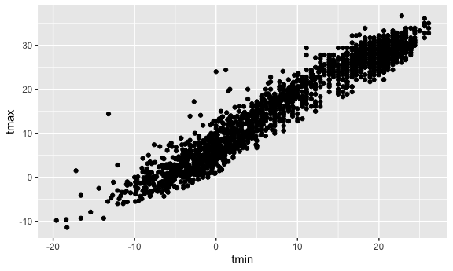
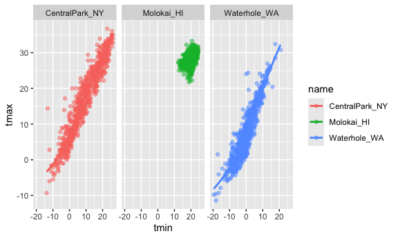

Visualization 1
================

SETUP

``` r
library(tidyverse)
## ── Attaching core tidyverse packages ──────────────────────── tidyverse 2.0.0 ──
## ✔ dplyr     1.1.4     ✔ readr     2.1.5
## ✔ forcats   1.0.0     ✔ stringr   1.5.1
## ✔ ggplot2   3.5.2     ✔ tibble    3.3.0
## ✔ lubridate 1.9.4     ✔ tidyr     1.3.1
## ✔ purrr     1.1.0     
## ── Conflicts ────────────────────────────────────────── tidyverse_conflicts() ──
## ✖ dplyr::filter() masks stats::filter()
## ✖ dplyr::lag()    masks stats::lag()
## ℹ Use the conflicted package (<http://conflicted.r-lib.org/>) to force all conflicts to become errors
library(ggridges)
library(p8105.datasets)
```

``` r
data("weather_df")
```

Basic Scatterplot

``` r
ggplot(weather_df, aes(x = tmin, y = tmax)) +
  geom_point()
## Warning: Removed 17 rows containing missing values or values outside the scale range
## (`geom_point()`).
```

<!-- --> vs

``` r
weather_df |>
  ggplot(aes(x = tmin, y = tmax)) + 
  geom_point()
## Warning: Removed 17 rows containing missing values or values outside the scale range
## (`geom_point()`).
```

<!-- -->

Advanced Scatterplot

``` r
weather_df |> 
  ggplot(aes(x = tmin, y = tmax)) + 
  geom_point(aes(color = name))
## Warning: Removed 17 rows containing missing values or values outside the scale range
## (`geom_point()`).
```

<!-- -->

``` r
weather_df |> 
  ggplot(aes(x = tmin, y = tmax)) + 
  geom_point(aes(color = name), alpha = .5) +
  geom_smooth(se = FALSE)
## `geom_smooth()` using method = 'gam' and formula = 'y ~ s(x, bs = "cs")'
## Warning: Removed 17 rows containing non-finite outside the scale range
## (`stat_smooth()`).
## Warning: Removed 17 rows containing missing values or values outside the scale range
## (`geom_point()`).
```

<!-- -->

``` r
weather_df |> 
  ggplot(aes(x = tmin, y = tmax, color = name)) + 
  geom_point(alpha = .5) +
  geom_smooth(se = FALSE) + 
  facet_grid(. ~ name)
## `geom_smooth()` using method = 'loess' and formula = 'y ~ x'
## Warning: Removed 17 rows containing non-finite outside the scale range
## (`stat_smooth()`).
## Warning: Removed 17 rows containing missing values or values outside the scale range
## (`geom_point()`).
```

<!-- -->

``` r
weather_df |> 
  ggplot(aes(x = date, y = tmax, color = name)) + 
  geom_point(aes(size = prcp), alpha = .5) +
  geom_smooth(se = FALSE) + 
  facet_grid(. ~ name)
## `geom_smooth()` using method = 'loess' and formula = 'y ~ x'
## Warning: Removed 17 rows containing non-finite outside the scale range
## (`stat_smooth()`).
## Warning: Removed 19 rows containing missing values or values outside the scale range
## (`geom_point()`).
```

<!-- --> Learning
Assessment
