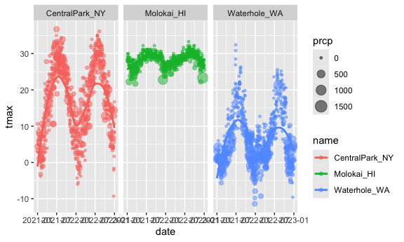
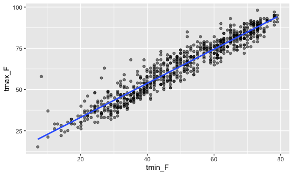
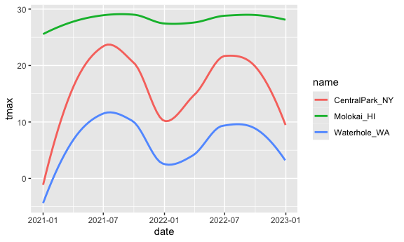
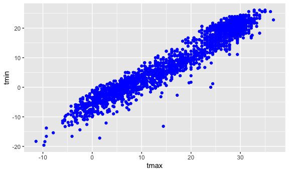
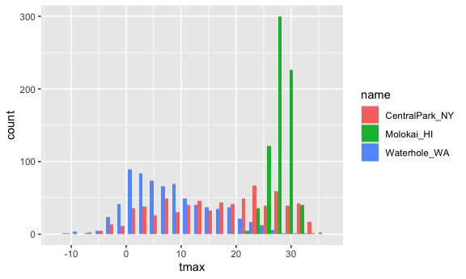
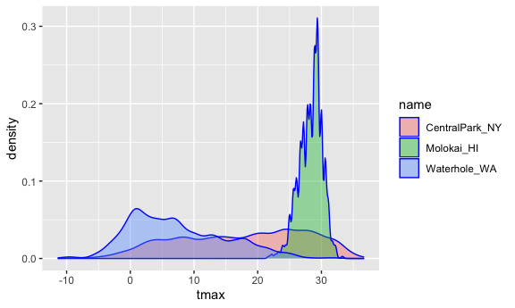
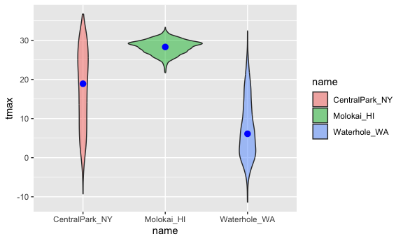
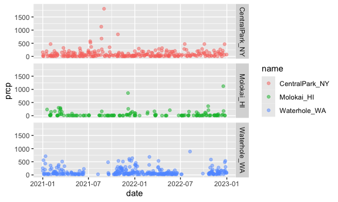

Visualization 1
================

SETUP

``` r
library(tidyverse)
## ── Attaching core tidyverse packages ──────────────────────── tidyverse 2.0.0 ──
## ✔ dplyr     1.1.4     ✔ readr     2.1.5
## ✔ forcats   1.0.0     ✔ stringr   1.5.1
## ✔ ggplot2   3.5.2     ✔ tibble    3.3.0
## ✔ lubridate 1.9.4     ✔ tidyr     1.3.1
## ✔ purrr     1.1.0     
## ── Conflicts ────────────────────────────────────────── tidyverse_conflicts() ──
## ✖ dplyr::filter() masks stats::filter()
## ✖ dplyr::lag()    masks stats::lag()
## ℹ Use the conflicted package (<http://conflicted.r-lib.org/>) to force all conflicts to become errors
library(ggridges)
library(p8105.datasets)
library(hexbin)
knitr::opts_chunk$set(
  fig.width = 6,
  fig.asp = .6,
  out.width = "90%"
)
```

``` r
data("weather_df")
```

## Basic Scatterplot

``` r
ggplot(weather_df, aes(x = tmin, y = tmax)) +
  geom_point()
## Warning: Removed 17 rows containing missing values or values outside the scale range
## (`geom_point()`).
```


vs

``` r
weather_df |>
  ggplot(aes(x = tmin, y = tmax)) + 
  geom_point()
## Warning: Removed 17 rows containing missing values or values outside the scale range
## (`geom_point()`).
```


## Advanced Scatterplot

``` r
weather_df |> 
  ggplot(aes(x = tmin, y = tmax)) + 
  geom_point(aes(color = name))
## Warning: Removed 17 rows containing missing values or values outside the scale range
## (`geom_point()`).
```


``` r
weather_df |> 
  ggplot(aes(x = tmin, y = tmax)) + 
  geom_point(aes(color = name), alpha = .5) +
  geom_smooth(se = FALSE)
## `geom_smooth()` using method = 'gam' and formula = 'y ~ s(x, bs = "cs")'
## Warning: Removed 17 rows containing non-finite outside the scale range
## (`stat_smooth()`).
## Warning: Removed 17 rows containing missing values or values outside the scale range
## (`geom_point()`).
```


``` r
weather_df |> 
  ggplot(aes(x = tmin, y = tmax, color = name)) + 
  geom_point(alpha = .5) +
  geom_smooth(se = FALSE) + 
  facet_grid(. ~ name)
## `geom_smooth()` using method = 'loess' and formula = 'y ~ x'
## Warning: Removed 17 rows containing non-finite outside the scale range
## (`stat_smooth()`).
## Warning: Removed 17 rows containing missing values or values outside the scale range
## (`geom_point()`).
```


``` r
weather_df |> 
  ggplot(aes(x = date, y = tmax, color = name)) + 
  geom_point(aes(size = prcp), alpha = .5) +
  geom_smooth(se = FALSE) + 
  facet_grid(. ~ name)
## `geom_smooth()` using method = 'loess' and formula = 'y ~ x'
## Warning: Removed 17 rows containing non-finite outside the scale range
## (`stat_smooth()`).
## Warning: Removed 19 rows containing missing values or values outside the scale range
## (`geom_point()`).
```


Learning Assessment

``` r
weather_df |> 
  filter(name == "CentralPark_NY") |> 
  mutate(
    tmax_F = (tmax * (9/5)) + 32,
    tmin_F = (tmin * (9/5)) + 32,
    tmax_C = tmax,
    tmin_C = tmin
  ) |> 
  select(-tmax, -tmin) |> 
  ggplot(aes(x = tmin_F, y = tmax_F)) +
  geom_point(alpha = 0.5) + 
  geom_smooth(method = "lm", se = FALSE)
## `geom_smooth()` using formula = 'y ~ x'
```



## Odds and Ends

``` r
weather_df |> 
  ggplot(aes(x = date, y = tmax, color = name)) + 
  geom_smooth(se = FALSE) 
## `geom_smooth()` using method = 'loess' and formula = 'y ~ x'
## Warning: Removed 17 rows containing non-finite outside the scale range
## (`stat_smooth()`).
```



``` r
weather_df |> 
  ggplot(aes(x = tmax, y = tmin)) + 
  geom_hex()
## Warning: Removed 17 rows containing non-finite outside the scale range
## (`stat_binhex()`).
```


Learning Assessment Why don’t these two produce the same result?

``` r
ggplot(weather_df) + geom_point(aes(x = tmax, y = tmin), color = "blue")
## Warning: Removed 17 rows containing missing values or values outside the scale range
## (`geom_point()`).
```



``` r
ggplot(weather_df) + geom_point(aes(x = tmax, y = tmin, color = "blue"))
## Warning: Removed 17 rows containing missing values or values outside the scale range
## (`geom_point()`).
```


The second line is adding a third aesthetic called color that gets
assigned to each dot, rather than coloring points blue.

## Univariate Plots

``` r
weather_df |> 
  ggplot(aes(x = tmax)) + 
  geom_histogram()
## `stat_bin()` using `bins = 30`. Pick better value with `binwidth`.
## Warning: Removed 17 rows containing non-finite outside the scale range
## (`stat_bin()`).
```


``` r
weather_df |> 
  ggplot(aes(x = tmax, fill = name)) + 
  geom_histogram(position = "dodge", binwidth = 2)
## Warning: Removed 17 rows containing non-finite outside the scale range
## (`stat_bin()`).
```



``` r
weather_df |> 
  ggplot(aes(x = tmax, fill = name)) + 
  geom_density(alpha = .4, adjust = .5, color = "blue")
## Warning: Removed 17 rows containing non-finite outside the scale range
## (`stat_density()`).
```



``` r
weather_df |> 
  ggplot(aes(x = name, y = tmax)) + 
  geom_boxplot()
## Warning: Removed 17 rows containing non-finite outside the scale range
## (`stat_boxplot()`).
```


``` r
weather_df |> 
  ggplot(aes(x = name, y = tmax)) + 
  geom_violin(aes(fill = name), alpha = .5) + 
  stat_summary(fun = "median", color = "blue")
## Warning: Removed 17 rows containing non-finite outside the scale range
## (`stat_ydensity()`).
## Warning: Removed 17 rows containing non-finite outside the scale range
## (`stat_summary()`).
## Warning: Removed 3 rows containing missing values or values outside the scale range
## (`geom_segment()`).
```



``` r
weather_df |> 
  ggplot(aes(x = tmax, y = name)) + 
  geom_density_ridges(scale = .85)
## Picking joint bandwidth of 1.54
## Warning: Removed 17 rows containing non-finite outside the scale range
## (`stat_density_ridges()`).
```


Learning Assessment

``` r
weather_df |> 
  filter(prcp != 0) |> 
  ggplot(aes(x = date, y = prcp, color = name)) +
  geom_point(alpha = 0.5) + 
  facet_grid(name ~ .) +
  ylim(0, 1900)
```


\## Saving and embedding plots

``` r
ggp_weather = 
  ggplot(weather_df, aes(x = tmin, y = tmax)) + 
  geom_point(aes(color = name), alpha = .5) 

ggsave("ggp_weather.pdf", ggp_weather, width = 8, height = 5)
## Warning: Removed 17 rows containing missing values or values outside the scale range
## (`geom_point()`).
```

``` r
fig.width = 12
ggplot(weather_df, aes(x = tmin, y = tmax)) + 
  geom_point(aes(color = name))
## Warning: Removed 17 rows containing missing values or values outside the scale range
## (`geom_point()`).
```


